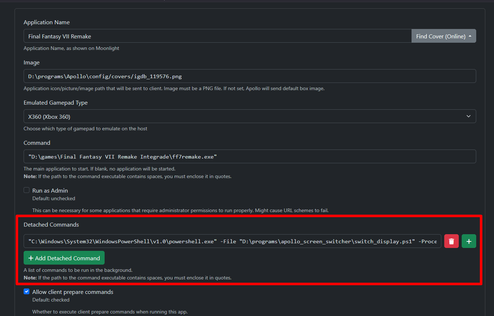

# Apollo Screen Switcher

A small PowerShell utility that automatically moves a game window to the Apollo virtual display.

Designed for Apollo game streaming setups where Windows creates a virtual monitor and games need to be moved there after launch.


## Requirements

- Windows 10 / Windows 11
- PowerShell 5.1 or newer
- Apollo virtual display configured and working

## Installation

Clone or download the repository:

```powershell
git clone https://github.com/Urvatov/apollo-display-switcher.git
```

Or simply download [switch_display.ps1](switch_display.ps1) and place it anywhere on your system.

## Usage

1. Create an application in Apollo.
2. In the **Command** field, set the full path to the game executable.
3. In the **Detached Commands** field, add:

```text
"<path\to\powershell>" -File "<path\to\switch_display.ps1>" -ProcessName "<game_process_name.exe>"
```

For example:

```text
"C:\Windows\System32\WindowsPowerShell\v1.0\powershell.exe" -File "D:\programs\apollo-display-switcher\switch_display.ps1" -ProcessName ff7remake_.exe
```

4. Launch the game through Apollo/Moonlight.

The script will wait for the game window and move it to the Apollo virtual display.



## Parameters

| Parameter           | Description                                       | Default                    |
| ------------------- | ------------------------------------------------- | -------------------------- |
| `-ProcessName`      | Game process name (`.exe` is optional)            | —                          |
| `-ProcessId`        | Specific process ID to target                     | —                          |
| `-WindowTitle`      | Optional window title filter. Supports wildcards  | —                          |
| `-MonitorIndex`     | Manually select the target monitor                | Automatic Apollo detection |
| `-WaitSeconds`      | How long to wait for the game window              | `60`                       |
| `-PollMilliseconds` | Interval between window checks                    | `350`                      |
| `-ListMonitors`     | List all monitors detected by Windows             | —                          |
| `-ListProcesses`    | List processes with visible windows               | —                          |
| `-WhatIf`           | Show what would be done without moving the window | —                          |

### Examples

List available monitors:

```powershell
.\switch_display.ps1 -ListMonitors
```

List processes with visible windows:

```powershell
.\switch_display.ps1 -ListProcesses
```

Move a game to the automatically detected Apollo display:

```powershell
.\switch_display.ps1 -ProcessName factorio.exe
```

Use a specific monitor:

```powershell
.\switch_display.ps1 -ProcessName factorio.exe -MonitorIndex 2
```

Target a specific process:

```powershell
.\switch_display.ps1 -ProcessId 12345
```

Filter by window title:

```powershell
.\switch_display.ps1 -ProcessName game.exe -WindowTitle "*Game*"
```

Increase the time allowed for the game window to appear:

```powershell
.\switch_display.ps1 -ProcessName game.exe -WaitSeconds 120
```

Preview the operation without moving the window:

```powershell
.\switch_display.ps1 -ProcessName game.exe -WhatIf
```

## Known Limitations

### Games with additional launch windows

Some games start additional processes or windows before the actual game window appears, such as launchers or anti-cheat software.

These games may not be detected correctly during the initial launch and may require running the script again after the game has started.

### Exclusive Fullscreen

Exclusive Fullscreen is not reliably supported.

The script moves and resizes a normal Windows window. Games using true Exclusive Fullscreen may take direct control over the display and prevent Windows from moving the game to another monitor.

For the best results, use **Borderless Fullscreen** / **Windowed Fullscreen** mode.
